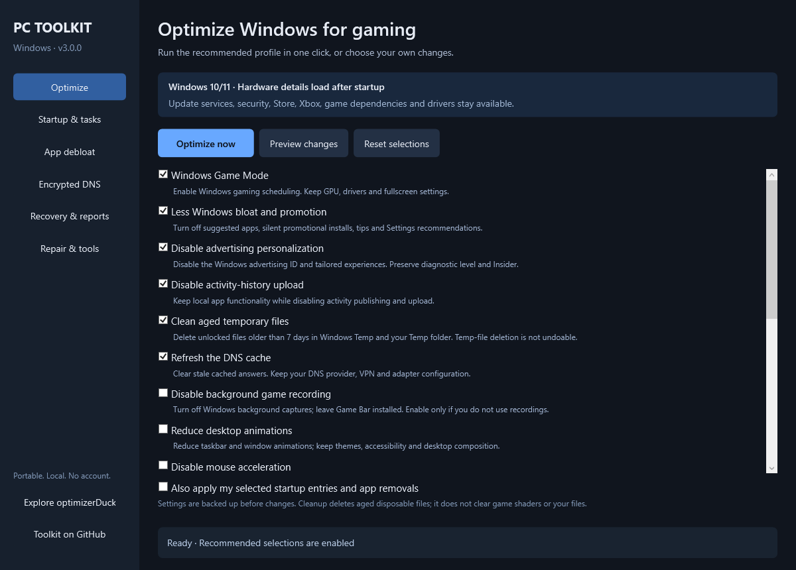

# Windows PC Toolkit

**Portable gaming, cleanup, debloat, privacy and repair in one native Windows dashboard.** Built-in PowerShell and WPF; no account, installer, advertising or background agent.

[](https://github.com/SenjuWoo/windows-pc-toolkit/actions/workflows/ci.yml) · [MIT license](LICENSE) · [Changelog](CHANGELOG.md)



Rendered from the actual WPF dashboard with initial selections. Hardware and results load on the target PC.

## Start here

Download the **complete current source** with GitHub's **Code → Download ZIP**, extract it, then double-click **START_TOOLKIT.bat**. Accept UAC for your own Windows account. Keep the tool folders and shared `Modules` folder together. Older releases do not contain this dashboard.

**Optimize now** applies six recommended actions together:

- Enable Windows Game Mode.
- Disable promotional suggestions and silent suggested-app installs.
- Disable advertising personalization and tailored experiences.
- Disable activity-history publishing and upload.
- Clean disposable Temp files older than seven days, checking write/access age and skipping protected paths, links and locked files.
- Refresh cached DNS answers, preserving provider and adapter settings.

**Preview changes** explains the plan without applying it. Eleven additional choices cover captures, mouse acceleration, animations, Explorer/taskbar preferences, Recall opt-out, Delivery Optimization cleanup, SSD ReTrim and targeted registry care. Some settings need sign-out to refresh; no restart is forced.

For a larger one-click run, first select desired apps and startup items on their pages, then tick **Also apply my selected startup entries and app removals** on Optimize. They share one operation/recovery journal. App removal has a confirmation naming the apps.

## Six organized pages

| Page | Features |
| --- | --- |
| Optimize | Recommended/custom choices, read-only preview, progress and results. |
| Startup & tasks | Registry startup entries and third-party boot/logon tasks; reviewed disable and original-state undo. Microsoft tasks are excluded. |
| App debloat | Consumer-app removal for your account after verified package copies. Store, Xbox, Gaming Services, WebView, frameworks and essential packages are excluded. |
| Encrypted DNS | Physical-adapter selection, coherent Quad9/AdGuard profiles, verification, previous-state restore and automatic DNS. |
| Recovery & reports | History, settings/startup undo, failure details and preservation of intervening registry changes. |
| Repair & tools | DISM then SFC, restore points, hardware/essential-service status, advanced consoles and Windows settings. |

The gaming console adds HAGS controls, temporary game-session priority/stay-awake, GPU/network/storage/display/PCVR audits and JSON benchmark snapshots. Session settings are released in `finally`, including interrupted sessions.

## Compatibility and registry care

The recommended profile preserves Windows Update, Defender, Store, Xbox, Gaming Services, browser state, AI model stores, drivers, power/sleep, shaders, network offloads, timers and GPU interrupt settings. It does not mass-disable services, reset networking or remove packages without reviewed selections.

Strict privacy, network reset and shader troubleshooting remain explicit advanced choices. No optimizer guarantees FPS gains or policy effects on every edition/build. Registry read-back proves a saved setting, not better frame times.

**Registry care is targeted repair:** remove dead startup/MuiCache values only when their executable is confirmed absent on a ready fixed local drive. Uninstall/App Paths/COM registrations and shortcuts remain for review. Broad registry sweeping is not an optimization profile.

## Encrypted DNS

Existing DoH entries are updated in place. Restore matches adapter GUIDs and separately preserves IPv4/IPv6 automatic versus static modes. Unrelated adapters, VPNs and other providers' DoH entries are preserved. Failed apply attempts rollback and reports any rollback failure.

Quad9 requires its live TXT transport test to report `doh`; an unavailable test fails verification. AdGuard checks configuration/resolution without claiming the same live attestation.

**Mullvad public encrypted DNS ends November 2, 2026.** Legacy profiles remain until then; new applies are subsequently blocked, while backup restore remains available. Use Quad9 or AdGuard for ongoing service. [Mullvad announcement](https://mullvad.net/en/blog/2026/9/3/shutting-down-our-public-encrypted-dns-servers-and-sponsoring-quad9-instead), [Quad9 services](https://docs.quad9.net/services/), [AdGuard DNS](https://adguard-dns.io/en/public-dns.html).

## Recommended companion: optimizerDuck

**We recommend [optimizerDuck](https://github.com/itsfatduck/optimizerDuck)** for broader Windows customization, optimization and management. It is a useful open-source companion and informed our coverage goals. Download it from [its own releases](https://github.com/itsfatduck/optimizerDuck/releases).

This toolkit uses an independent implementation and a narrower automatic profile focused on update/game compatibility. No Duck binary or GPL source is bundled. See the [feature coverage map](docs/FEATURE_COVERAGE.md) for overlap and differences.

## Recovery

Dashboard reports, typed registry journals, task states and verified package copies live in `%ProgramData%\WindowsPCToolkit\Suite\Runs` and `Suite\AppBackups`.

Registry state is saved **before** mutation, preserves types/literal environment strings, and is checked after restore. Undo keeps intervening registry changes and lists conflicts. Repeating completed undo preserves current state. Failed registry actions attempt to restore partial changes.

Deleted temporary/cache files are not recoverable through the journal. App removal can delete app data; backups support package re-registration, not app-data recovery. Dependencies/servicing may prevent re-registration; the report identifies failures and Microsoft Store remains the reinstall route. System repair is logged maintenance, not a reversible registry tweak.

Advanced consoles retain directories under `%ProgramData%\WindowsPCToolkit`: `GamingOptimizer\Snapshots`, `PrivacyGuard\Snapshots`, `EncryptedDNS\Snapshots`, `PCFixer\NetworkSnapshots` / `AIFeatureSnapshots`, and `Cleaner\Logs` / `RegistryBackups`.

## Components

| Component | Version | Documentation |
| --- | ---: | --- |
| Dashboard / core | 3.0.0 | This page |
| Gaming Optimizer | 5.0 | [Gaming](pc-gaming-optimizer/README.md) |
| PC Cleaner | 1.1 | [Cleanup/registry](pc-cleaner/README.md) |
| Corruption Fixer | 7.2 | [Repair](pc-corruption-fixer/README.md) |
| Privacy Guard | 2.1 | [Privacy](pc-privacy-guard/README.md) |
| Encrypted DNS | 2.2 | [DNS](dns-encrypted-doh/README.md) |

## Requirements and validation

Windows 11 is the main target. General tools also support Windows 10; Windows 11 options are build-gated and system DoH requires Windows 11. Use built-in **Windows PowerShell 5.1** in STA mode; the launcher supplies the executable/arguments. No extra runtime is needed.

```powershell
# Read-only plan
powershell.exe -NoProfile -ExecutionPolicy Bypass -File .\Toolkit.Run.ps1 -Preview
# Static checks
powershell.exe -NoProfile -ExecutionPolicy Bypass -File .\Validate_All.ps1
# Disposable registry/filesystem, actual WPF, simulated failures
powershell.exe -NoProfile -STA -ExecutionPolicy Bypass -File .\tests\Test_Toolkit.ps1
```

Tests do not apply live optimization or change live DNS/update services. [Validation evidence and limits](VALIDATION_REPORT.md).
